# **Assignment 2**
### Course: Design and analysis of algorithms
### Group: SE-2539
### Full name: Aktanbi Kusman
# Implementation of Dynamic Array data structure:

## Complexity
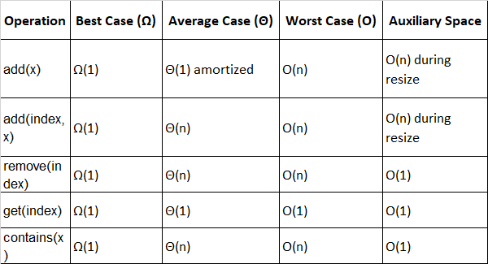

## Review

In this part of Assignment 2, I implemented a Dynamic Array data structure using Java.

The purpose of this implementation is to understand how a dynamic array stores elements, manages its size and capacity, and performs basic operations.

The Dynamic Array was implemented without using Java's built-in collection classes.

`add(int x)` - Adds an elements to the end of array.

`add(int index, int x)` - Inserts an elements at a chosed index.

`remove(int index)` - removes an element at a chosed index.

`get(int index)` - returns the lement at a specified index.

`contains(int x)` - Checks whether the array contains a given element.

`resize()` - increases the capacity of the array when it becomes full.

`checkIndex(int index)` - checks whether an index is valid.

## Internal structure:

DynamicArray uses the following fields:
* `data` -an integer array that stores the elements.
* `size` - the number of elements stored in internal array
* `capacity` - the total number of elements that the internal array can hold

# Implementation of Linked List data structure

## Complexity
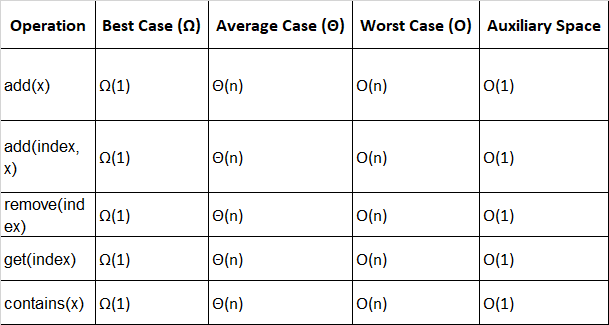

## Review

In this part of Assignment 2, I implemented a Linked List data structure using Java.

The purpose of this implementation is to understand how a linked list stores elements using nodes and references, and how it performs basic operations.

The Linked List was implemented without using Java's built-in collection classes.

### Implemented Operations

`add(int x)` - Adds an element to the end of the list.

`add(int index, int x)` - Inserts an element at a chosen index.

`remove(int index)` - Removes an element at a specified index.

`get(int index)` - Returns the element at a specified index.

`contains(int x)` - Checks whether the list contains a given element.

`checkIndex(int index)` - Checks whether an index is valid.

`getSize()` - Returns the number of elements stored in the list.

### Internal Structure

LinkedList uses the following fields and components:

* `Node` - A private static class that represents an individual element in the linked list.
* `data` - An integer value stored inside each node.
* `next` - A reference to the next node in the list.
* `head` - A reference to the first node in the list.
* `size` - The number of elements currently stored in the list.

Each node stores an integer value and a reference to the next node. 
The last node points to `null`, which indicates the end of the list.

The `head` reference is `null` when the list is empty.

### Implementation Details

The Linked List uses a singly linked structure, where each node points to the next node.

To access or modify an element at a specific index, the implementation traverses the list starting from the head.

When inserting an element, the new node is connected to the appropriate position by updating references.

When removing an element, the reference of the previous node is updated to skip the removed node.

The `size` variable is updated after each insertion and removal operation.

# Implementation of Min-Heap data structure

## Complexity
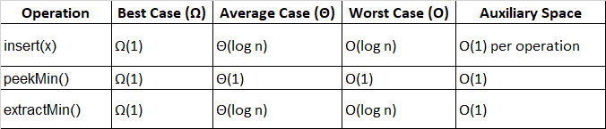

## Review

In this part of Assignment 2, I implemented a Min-Heap data structure using Java.

The purpose of this implementation is to understand how a binary heap stores elements and maintains the heap property while performing insertion and extraction operations.

The Min-Heap was implemented using a regular integer array without using Java's built-in PriorityQueue or other collection classes.

### Implemented Operations

`insert(int x)` - Inserts a new element into the heap and restores the Min-Heap property.

`peekMin()` - Returns the minimum element without removing it from the heap.

`extractMin()` - Removes and returns the minimum element, then restores the Min-Heap property.

`getSize()` - Returns the number of elements currently stored in the heap.

`isEmpty()` - Checks whether the heap contains any elements.

### Internal Structure

MinHeap uses the following fields and components:

* `data` - An integer array that stores the heap elements.
* `size` - The number of elements currently stored in the heap.
* `capacity` - The total number of elements that the internal array can hold.

The heap is represented as a complete binary tree stored in an array.

For an element at index `i`, the indices of its children and parent are calculated using the following formulas:

* Parent: `(i - 1) / 2`
* Left child: `2 * i + 1`
* Right child: `2 * i + 2`

The root of the heap is stored at index 0 and contains the minimum element.

### Implementation Details

The implementation maintains the Min-Heap property, which requires every parent element to be less than or equal to its children.

The `insert()` operation adds a new element at the end of the array and uses `siftUp()` to move the element towards the root if necessary.

The `peekMin()` operation returns the root element without modifying the heap.

The `extractMin()` operation removes the root, moves the last element to the root position, and uses `siftDown()` to restore the heap property.

The `swap()` method exchanges two elements in the array.

The `resize()` method doubles the capacity when the internal array becomes full and copies the existing elements into a new array.

# Loop Invariant Proofs
## 1. DynamicArray — add(index, value)

Purpose: To prove that the loop correctly shifts elements to the right when inserting a new element at a specified index.

The loop moves elements from right to left:

for (int i = size; i > index; i--) {
data[i] = data[i - 1];
}
### 1. Initialization (Base Case)

Initially, i = size.

No elements have been shifted yet. The range of shifted elements is empty.

The invariant is:

At the beginning of each iteration, all original elements with indices from i to size - 1 have been copied one position to the right, preserving their original values.

Initially, this condition is true because no elements have been processed.

### 2. Maintenance (Inductive Step)

Assume the invariant holds at the beginning of an iteration.

The algorithm executes:

data[i] = data[i - 1];

The original element at index i - 1 is copied to index i.

Then i decreases by one.

Therefore, the range of correctly shifted elements expands by one position to the left, and the invariant remains true.

### 3. Termination

The loop terminates when i == index.

At this point, all original elements from index to size - 1 have been shifted one position to the right.

The algorithm can safely insert the new value at data[index].

Therefore, the elements remain in their original relative order, and the new element is inserted at the correct position.

Conclusion: The loop correctly shifts the elements and preserves the order of the array.

## 2. LinkedList — get(index)

Purpose: To prove that the traversal loop reaches the node at the requested index.

The loop traverses the linked list:

Node current = head;

for (int i = 0; i < index; i++) {
current = current.next;
}
### 1. Initialization (Base Case)

Initially, i = 0 and current = head.

The head node is the first node in the linked list, located at index 0.

The invariant is:

At the beginning of each iteration, current points to the node at position i in the linked list.

Initially, current points to the node at position 0, so the invariant holds.

### 2. Maintenance (Inductive Step)

Assume the invariant holds at the beginning of an iteration.

The algorithm executes:

current = current.next;

The pointer moves to the next node in the linked list.

At the same time, i increases by one.

Since the next node is exactly one position after the current node, current now points to the node at position i.

Therefore, the invariant remains true.

### 3. Termination

The loop terminates when i == index.

According to the invariant, current points to the node at the requested index.

The algorithm returns current.data, which is the value stored at that position.

Conclusion: The traversal loop correctly reaches and returns the element at the specified index.

## 3. MinHeap — siftDown()

Purpose: To prove that the siftDown() operation restores the min-heap property after replacing the root with the last element.

The loop repeatedly compares the current node with its children and swaps it with the smallest child when necessary.

### 1. Initialization (Base Case)

Initially, the current node is the root of the heap.

After the root is replaced by the last element, the subtrees below the root are still valid min-heaps. Only the root may violate the min-heap property.

The invariant is:

At the beginning of each iteration, all subtrees below the current node satisfy the min-heap property, and the only possible violation is between the current node and its children.

Initially, this condition holds because the original subtrees were valid min-heaps, and only the root was replaced.

### 2. Maintenance (Inductive Step)

Assume the invariant holds at the beginning of an iteration.

The algorithm compares the current node with its left and right children and identifies the smallest among them.

If the current node is already the smallest, the loop terminates.

Otherwise, the current node is swapped with its smallest child.

After the swap, the smaller element moves to the current position, satisfying the min-heap property at that position.

The element that moved down may still violate the min-heap property with its own children. Therefore, the algorithm continues from that child's position.

All other subtrees remain valid min-heaps.

Thus, the only possible violation remains at the new current node, and the invariant is preserved.

### 3. Termination

The loop terminates when the current node is smaller than or equal to both its children, or when it reaches a leaf.

At this point, the current node satisfies the min-heap property, and all subtrees below it are valid min-heaps.

Since all other parts of the heap were already valid, the entire tree satisfies the min-heap property.

Conclusion: The siftDown() operation correctly restores the min-heap property after extracting the minimum element.

# Testing

A custom test class (`Tests.java`) was created to verify the correctness of the implemented data structures.

### DynamicArray
- Tested adding elements at the end and at a specified index.
- Tested removing elements from the beginning, middle, and end.
- Tested `get()` and `contains()` operations.
- Tested empty array behavior, duplicate values, and invalid indices.

### LinkedList
- Tested adding elements at the end and at a specified index.
- Tested removing elements from different positions.
- Tested `get()` and `contains()` operations.
- Tested empty list behavior, duplicate values, and invalid indices.

### MinHeap
- Tested insertion of multiple elements, including duplicates.
- Verified that `peekMin()` returns the minimum element.
- Verified that repeated `extractMin()` calls return elements in non-decreasing order.
- Tested empty heap behavior and extraction of a single element.

All implemented tests passed successfully.

# Performance Benchmarking

## Random Access

The first performance experiment compares random access in `DynamicArray` and `LinkedList`.

**Methodology:**
- Input sizes: 100, 1,000, 10,000, and 100,000 elements.
- Number of repetitions: 5 for each input size.
- Random data generated using `Random(42)` for reproducibility.
- Random indices are generated before the timed section.
- Execution time is measured using `System.nanoTime()`.
- Each repetition performs 10,000 calls to `get(index)`.
- The elapsed time is recorded in nanoseconds.

The structures are initialized and populated before the timer starts, 
so the experiment measures random access rather than construction time.

### Results and Preliminary Discussion

The benchmark results are exported to `benchmark_results.csv`.

The CSV file contains the structure name, workload, input size, repetition number, and measured execution time.

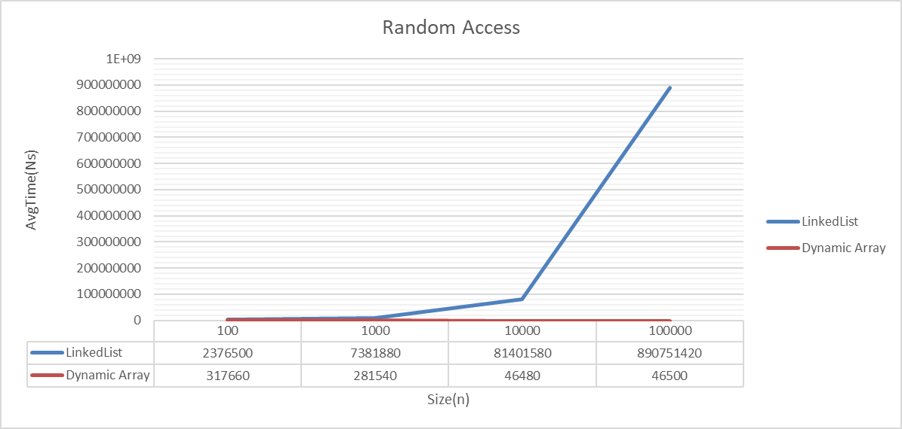

The graph illustrates the difference in random access performance between the two data structures. While LinkedList execution time increases considerably with input size, DynamicArray maintains relatively stable execution times for larger inputs.

The results demonstrate the practical impact of indexed access complexity on performance.

As the input size increases, the average execution time of LinkedList random access increases significantly. 
For an input size of 100,000 elements, the average execution time reaches 890,751,420 ns.

In contrast, DynamicArray demonstrates relatively stable access times across the tested input sizes. 
Its average execution time remains around 46,000 ns for input sizes of 10,000 and 100,000 elements.

These results are consistent with the theoretical time complexities of the two data structures. 
DynamicArray provides constant-time indexed access, Θ(1), because elements can be accessed directly by index. 
In comparison, LinkedList requires traversal from the head to reach the requested position, resulting in Θ(n) worst-case time complexity.

The experimental results illustrate how the choice of data structure affects random access performance as the input size increases.

The Random Access experiment is implemented.

## Search

The second benchmark evaluates the `contains(x)` operation
for DynamicArray and LinkedList.

**Methodology:**
- Input sizes: 100, 1,000, 10,000, and 100,000.
- Five repetitions for each input size.
- 10,000 search queries per repetition.
- Half of the queries use values selected from the input data.
- The other half use -1, which is not present in the generated data.
- The same query values are used for both data structures.
- Execution time is measured using `System.nanoTime()`.
- Input data and search queries are generated before timing.

The results are recorded in `benchmark_results.csv`.

The experiment allows us to compare linear search performance
in a dynamic array and a singly linked list.

### Results

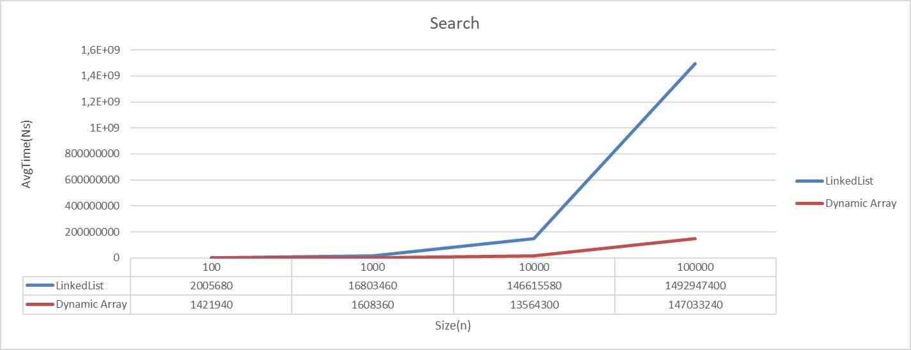

### Search Performance Analysis

The graph compares the average search execution time of `DynamicArray` and `LinkedList` for different input sizes: 
100, 1,000, 10,000, and 100,000 elements.

As the input size increases, the execution time of both data structures grows significantly. 
However, `LinkedList` demonstrates considerably higher search times, particularly for larger inputs.

For an input size of 100,000 elements, `DynamicArray` requires an average of 147,033,240 ns, 
while `LinkedList` requires 1,492,947,400 ns. This shows that LinkedList takes approximately 10.15 times longer than 
DynamicArray for this workload.

The results are consistent with the theoretical time complexity of linear search. 
In the worst case, both data structures require Θ(n) time because the algorithm may need to examine every 
element to determine whether the target exists.

Although both structures have the same asymptotic search complexity, their practical execution times differ. 
DynamicArray provides direct access to elements by index, which can improve memory access efficiency. 
LinkedList must traverse its nodes sequentially, resulting in additional traversal overhead.

Overall, the benchmark demonstrates that both data structures experience increasing search times as the input 
size grows, while DynamicArray performs faster than LinkedList in the tested workloads.

## Insert and Remove

The third performance experiment compares insertion and removal
operations in `DynamicArray` and `LinkedList`.

**Methodology:**
- Input sizes: 100, 1,000, 10,000, and 100,000 elements.
- Five repetitions for each input size.
- Each repetition uses a freshly initialized data structure.
- Initial data is generated using `Random(42)`.
- Data structure initialization is performed before the timed section.
- Execution time is measured using `System.nanoTime()`.
- The elapsed time is recorded in nanoseconds.

The following workloads are implemented:

| Workload        | Description                            |
|-----------------|----------------------------------------|
| InsertBeginning | Insert an element at index 0.          |
| RemoveBeginning | Remove an element at index 0.          |
| InsertMiddle    | Insert an element at the middle index. |
| RemoveMiddle    | Remove an element at the middle index. |

For each workload, the same input data is used to initialize
both data structures.

The experiment measures the cost of inserting and removing
elements at different positions and allows us to compare
the behavior of array-based and linked-list-based structures.

### Insert and Remove at beginning

### Insert at Beginning
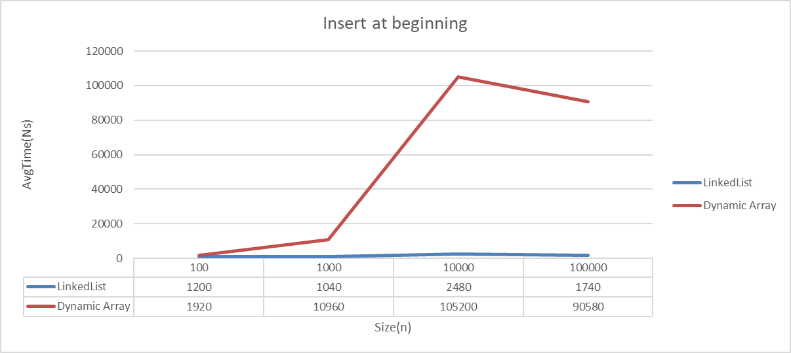
The graph compares insertion times at the beginning of both data structures.
LinkedList maintains relatively low execution times as the input size increases,
DynamicArray generally requires more time because existing elements must be shifted.

The graph compares the average execution time of inserting an element at the beginning of 
`DynamicArray` and `LinkedList` for input sizes of 100, 1,000, 10,000, and 100,000 elements.

The results show that `LinkedList` performs insertion at the beginning faster than `DynamicArray` 
across all tested input sizes. For an input size of 100,000 elements, the average execution time of 
`DynamicArray` is 90,580 ns, while `LinkedList` requires only 1,740 ns.

This difference is explained by the internal structure of the data structures. Inserting an element 
at the beginning of a DynamicArray requires shifting existing elements to the right, resulting in Θ(n) time complexity. 
In contrast, LinkedList can insert a new node at the head by updating a small number of references, 
resulting in Θ(1) time complexity.

The DynamicArray results generally increase with input size, although the measured time for 100,000 elements
is lower than for 10,000 elements. This variation may be caused by measurement noise and runtime effects.

Overall, the benchmark illustrates the difference between the linear insertion cost of DynamicArray and the 
constant-time insertion cost of LinkedList at the beginning.

### Remove at beginning
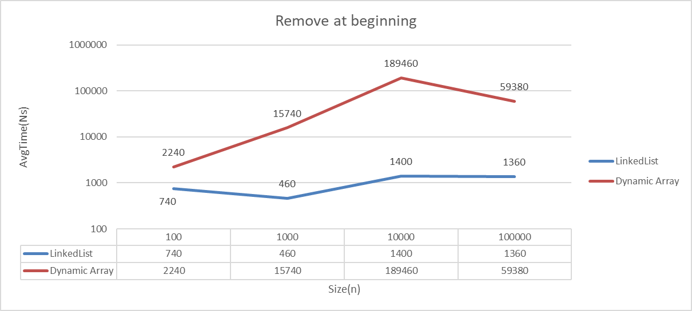

The graph compares the average execution time of removing an element from the beginning of `DynamicArray` 
and `LinkedList` for input sizes of 100, 1,000, 10,000, and 100,000 elements.

The results show that `LinkedList` performs removal at the beginning faster than `DynamicArray` 
for all tested input sizes. For an input size of 100,000 elements, `DynamicArray` 
requires an average of 59,380 ns, while `LinkedList` requires only 1,360 ns.

This difference can be explained by the internal structure of the data structures. 
Removing the first element from a DynamicArray requires shifting the remaining elements one position to the left, 
resulting in Θ(n) time complexity. In contrast, LinkedList can remove the first node by updating its head reference, 
resulting in Θ(1) time complexity.

The DynamicArray execution time generally increases with input size, 
although the measured time at 100,000 elements is lower than at 10,000 elements. 
This variation may be caused by measurement noise, JVM runtime effects, or other environmental factors.

LinkedList maintains relatively low execution times as the input size increases, 
which is consistent with its constant-time removal at the beginning.

Overall, the benchmark demonstrates the advantage of LinkedList for removing 
elements from the beginning of a collection.

### Insert Middle
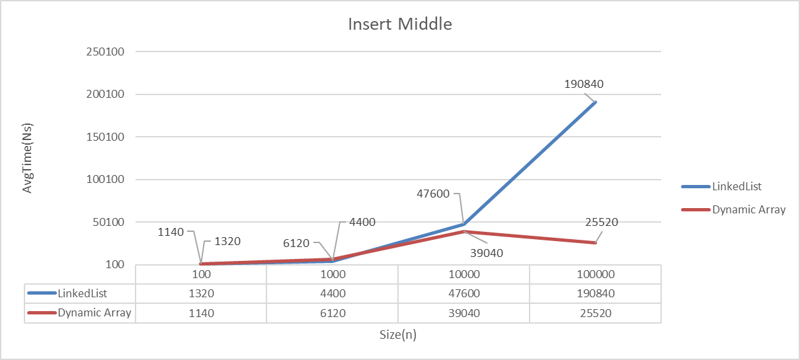

The graph compares the average execution time of inserting an element into the middle of 
`DynamicArray` and `LinkedList` for input sizes of 100, 1,000, 10,000, and 100,000 elements.

For smaller input sizes, both data structures demonstrate relatively low insertion times. 
However, as the input size increases, the execution time of LinkedList grows significantly. 
At 100,000 elements, DynamicArray requires an average of 25,520 ns, while LinkedList requires 190,840 ns.

Both data structures have Θ(n) time complexity for insertion in the middle. 
DynamicArray must shift elements to make room for the new element. 
LinkedList must traverse the list to reach the middle position before inserting a new node.

Although both operations have the same asymptotic complexity, their practical performance differs. 
DynamicArray provides direct indexed access to the insertion position, 
while LinkedList requires sequential traversal through its nodes.

The DynamicArray measurement at 100,000 elements is lower than the measurement at 10,000 elements. 
This irregularity may be caused by JVM runtime behavior, measurement noise, or other environmental factors. 
Therefore, the results should be interpreted as experimental measurements 
rather than perfectly increasing execution times.

Overall, the benchmark demonstrates that both data structures require linear time for middle insertion, 
but DynamicArray has lower measured execution time for the largest tested input.

### Remove Middle
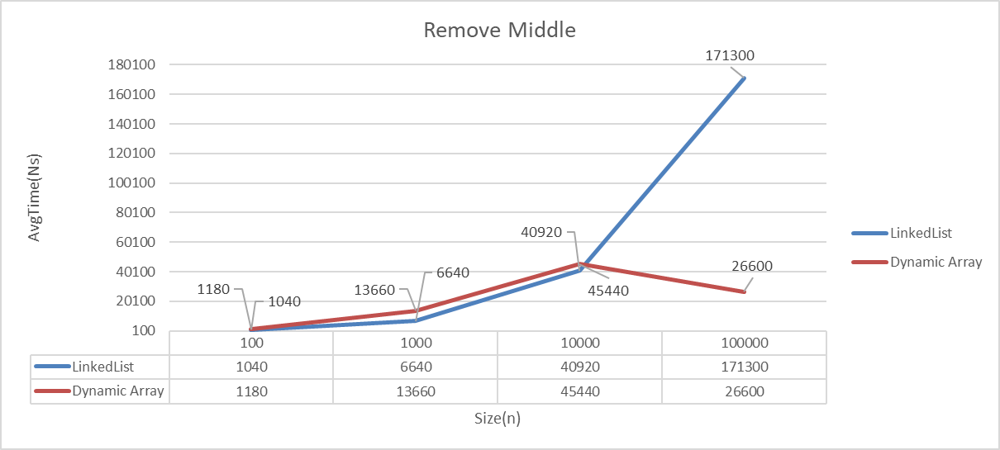

The graph compares the average execution time of removing an element from the middle of 
`DynamicArray` and `LinkedList` for input sizes of 100, 1,000, 10,000, and 100,000 elements.

For smaller input sizes, both data structures demonstrate relatively low removal times. 
As the input size increases, LinkedList execution time grows significantly. 
For an input size of 100,000 elements, 
DynamicArray requires an average of 26,600 ns, while LinkedList requires 171,300 ns.

Both data structures have Θ(n) time complexity for removing an element from the middle. 
DynamicArray must shift the elements after the removed position to fill the gap. 
LinkedList must traverse the list to reach the target node before removing it by updating references.

Although both operations have the same asymptotic time complexity, their practical performance differs. 
DynamicArray provides direct access to the target index, while LinkedList requires sequential traversal.

The DynamicArray measurement at 100,000 elements is lower than its measurement at 10,000 elements. 
This variation may be caused by measurement noise, JVM runtime behavior, or other environmental factors. 
Therefore, individual measurements do not always increase monotonically with input size.

Overall, the benchmark shows that DynamicArray has lower measured execution time for the largest input, 
while both data structures exhibit linear-time complexity for removal from the middle.

### Comparison of Middle Insertion and Removal

The results for insertion and removal in the middle show similar performance patterns. 
Both operations have Θ(n) time complexity for DynamicArray and LinkedList, but for different reasons.

DynamicArray provides constant-time indexed access to the middle position, 
but must shift elements during insertion or removal. 
LinkedList must traverse the list to reach the target position, 
while the actual insertion or removal of a node requires only a constant number of reference updates.

For the largest tested input size of 100,000 elements, 
DynamicArray demonstrates lower measured execution times for both middle insertion and removal. 
These results illustrate how the internal representation and memory access patterns of a data 
structure can affect practical performance, even when their asymptotic time complexities are the same.

## Priority Processing (MinHeap)

The fourth performance experiment evaluates the performance
of the custom `MinHeap` implementation.

**Methodology:**
- Input sizes: 100, 1,000, 10,000, and 100,000 elements.
- Five repetitions for each input size.
- Input data is generated using `Random(42)`.
- Execution time is measured using `System.nanoTime()`.
- The elapsed time is recorded in nanoseconds.

The following workloads are implemented:

| Workload       | Description                                                |
|----------------|------------------------------------------------------------|
| HeapInsert     | Insert all input elements into an initially empty MinHeap. |
| HeapExtractMin | Extract all elements from a previously populated MinHeap.  |

For the `HeapInsert` workload, the timer starts before inserting
the input elements and stops after all insertions are completed.

For the `HeapExtractMin` workload, the heap is populated before
the timer starts. The timed section measures the extraction
of all elements using `extractMin()`.

This separation allows insertion and extraction performance
to be evaluated independently.

### MinHeap Performance Analysis
#### Insert Operation
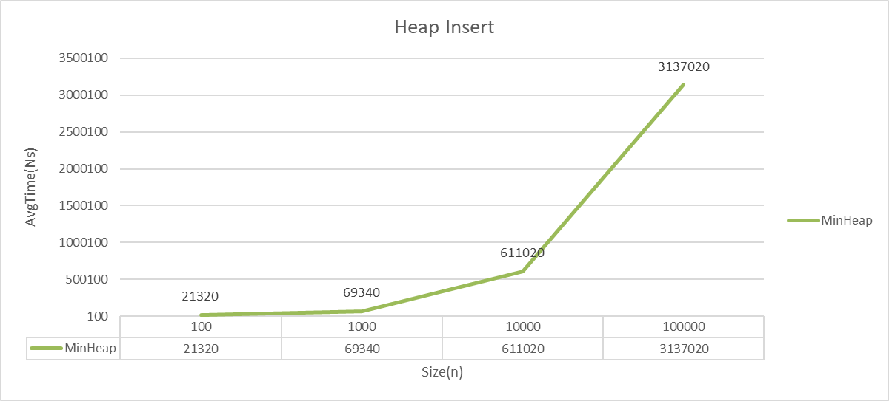

The `MinHeap` insertion operation adds a new element while maintaining the min-heap property. 
After inserting an element at the end of the heap, the element may need to move upward through 
the heap until its parent is smaller or equal.

The time complexity of a single insertion is O(log n) in the worst case, because the heap has a height of O(log n). 
In the best case, when the inserted element does not need to move upward, the operation takes Ω(1) time. 
Therefore, the worst-case time complexity is O(log n), and the best-case time complexity is Ω(1).

The benchmark measures the total time required to insert n elements into an initially empty MinHeap. 
Consequently, the theoretical worst-case complexity of the complete workload is O(n log n), rather than O(log n), 
because n individual insertions are performed.

The graph shows that the total execution time increases as the input size grows. For 100 elements, 
the average time is 21,320 ns. For 1,000 elements, it is 69,340 ns. For 10,000 elements, 
it reaches 611,020 ns, and for 100,000 elements, it reaches 3,137,020 ns.

The increase in execution time is consistent with the theoretical O(n log n) complexity of 
inserting n elements individually into a binary min-heap. The measured time does not increase by exactly the same 
factor as the input size, which is expected due to runtime overhead, memory allocation, and measurement variation.

Overall, the experimental results support the theoretical analysis: inserting all n elements requires more time 
as n increases, while each individual insertion takes at most logarithmic time.

#### Extract Operation
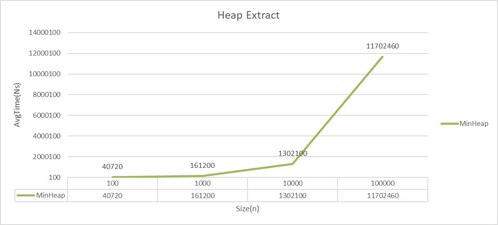

The graph illustrates the average execution time of extracting all elements from a pre-populated 
MinHeap for input sizes of 100, 1,000, 10,000, and 100,000 elements.

The results show that the total execution time increases as the input size grows. For 100 elements, 
the average execution time is 40,720 ns. For 1,000 elements, it increases to 161,200 ns. 
At 10,000 elements, the time reaches 1,302,100 ns, while for 100,000 elements, it reaches 11,702,460 ns.

The `extractMin()` operation removes and returns the smallest element, which is stored at the root of the heap. 
After removing the root, the last element is moved to the root, and the heap property is 
restored by moving the replacement element downward.

A single `extractMin()` operation has Θ(log n) time complexity because the replacement element may travel 
through the height of the binary heap. The best-case complexity is Θ(1), when no downward movement is required.

The benchmark measures the total time required to extract all n elements from the heap. 
Therefore, its theoretical worst-case time complexity is O(n log n), since each of the n extraction 
operations may require O(log n) time.

The experimental results are consistent with the theoretical analysis. As the input size increases, 
the total execution time also increases, reflecting the cost of performing n logarithmic-time extraction operations.

Overall, the benchmark demonstrates that extracting all elements from a MinHeap requires O(n log n) time in the worst case.

#### Comparison of Heap Insertion and Extraction

The benchmark results show that both inserting and extracting n elements from a MinHeap require increasing execution time as the input size grows.

For HeapInsert, the total execution time increases from 21,320 ns for 100 elements to 3,137,020 ns for 100,000 elements.

For HeapExtractMin, the total execution time increases from 40,720 ns for 100 elements to 11,702,460 ns for 100,000 elements.

Both workloads have a worst-case time complexity of O(n log n). Heap insertion restores the heap property by moving elements upward, while extraction restores it by moving elements downward.

In the tested workloads, extracting all elements takes more time than inserting all elements. This difference may be related to the operations required to restore the heap property and the implementation's runtime overhead.

The measured results for both operations are consistent with their theoretical worst-case complexities.

### Benchmark Summary

The benchmark suite currently includes the following workloads:

| Data Structure | Workloads                                                                          |
|----------------|------------------------------------------------------------------------------------|
| DynamicArray   | RandomAccess, Search, InsertBeginning, RemoveBeginning, InsertMiddle, RemoveMiddle |
| LinkedList     | RandomAccess, Search, InsertBeginning, RemoveBeginning, InsertMiddle, RemoveMiddle |
| MinHeap        | HeapInsert, HeapExtractMin                                                         |

Each workload is executed for four input sizes with five
repetitions per size.

The results are stored in `benchmark_results.csv` and will
be used for further performance analysis and visualization.